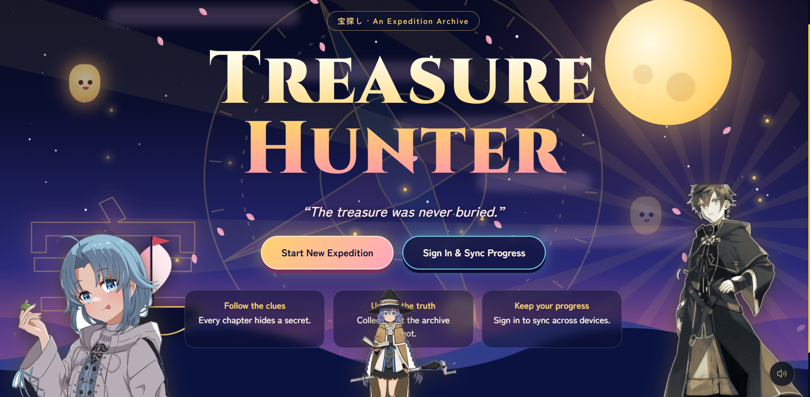
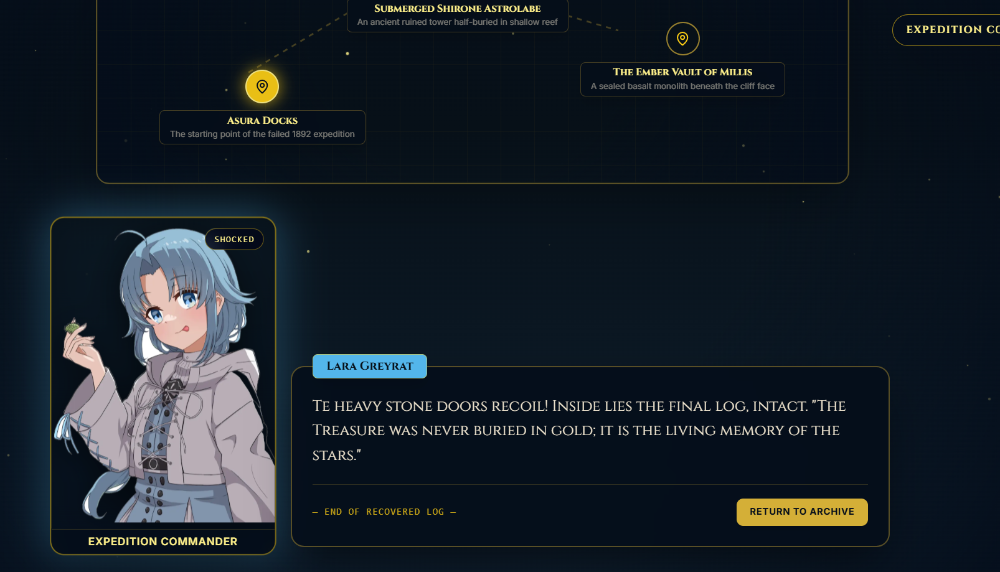

# Treasure Hunter

The protoype for a mysterious web-based treasure-hunting game where players solve puzzles, decode hidden messages, and explore a world filled with secrets.

## Made By
Four Seasons Village is being developed by:
| Team Member | Contact |
|---|---|
| tls123 | [Github](https://github.com/Tareq-Khalil) |
| Mazen Khalil | [Github](https://github.com/mazenahmed1721)|
| Mohamed Salama | [Github](https://github.com/MADO3308)
---
## Description

Treasure Hunter is a puzzle and exploration game built around discovering clues, solving ciphers, and uncovering hidden secrets. Players progress through different challenges where every solved puzzle brings them closer to the final treasure.

### Screenshots

## Getting Started
### Dependencies

Before running Treasure Hunter, make sure you have:
- A modern web browser
- An internet connection
- Any dependencies specified by the project's package manager

### Installing

Clone the repository:

`git clone https://github.com/Tareq-Khalil/treasure-hunter.git`

Move into the project directory:

`cd treasure-hunter`

Install the required dependencies:

`npm install`

Create a .env file based on the provided .env.example file and add the required values:
- `NEXT_PUBLIC_SUPABASE_URL`
- `NEXT_PUBLIC_SUPABASE_ANON_KEY`
Make a Supabase project and paste the content of the file `supabase/01_supa.sql` in it, then get the required env variables from the project's settings.
### Executing program

Start the development server:

`npm run dev`

Then:

Open the local URL shown in the terminal.
1. Enter the game.
2. Explore the available clues and challenges.
3. Solve the puzzles to progress.
4. Keep track of discovered information and hidden clues.
5. Continue until you uncover the treasure.

To create a production build:

`npm run build`
## Help

If the website does not start correctly:

1. Make sure Node.js is installed.
2. Run npm install again to ensure all dependencies are installed.
3. Check that your `.env` file contains the required variables.
4. Make sure the development server is not already using the selected port(been there before).
5. Check the browser console and terminal for error messages.

To check your Node.js and npm versions:

- `node --version`
- `npm --version`

If dependencies become corrupted, try:

- `rm -rf node_modules`
- `npm install`

On Windows PowerShell, you can instead remove the node_modules folder manually and run:

`npm install`

## License

This project is licensed under the [MIT License](LICENSE)
